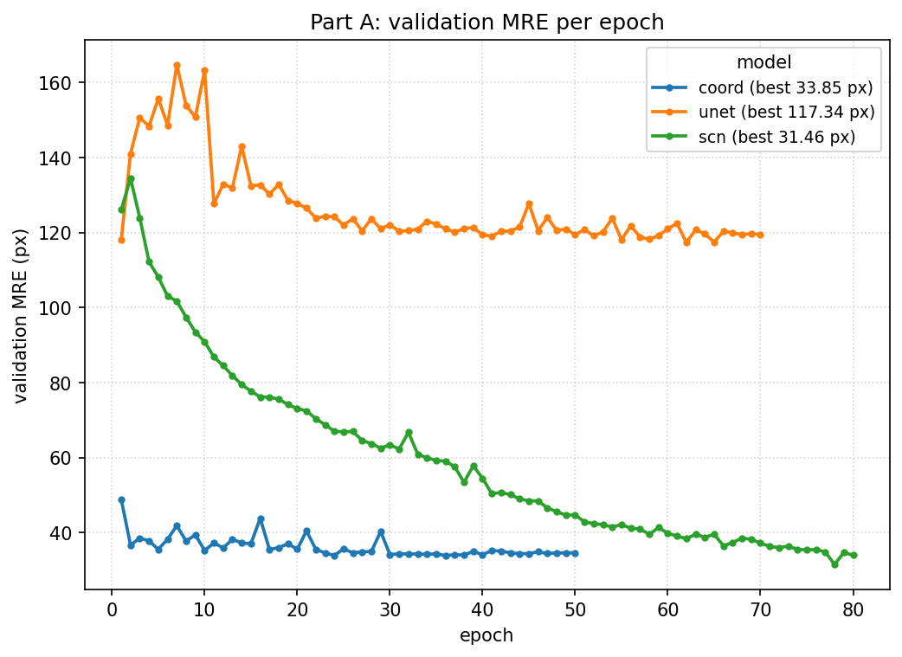
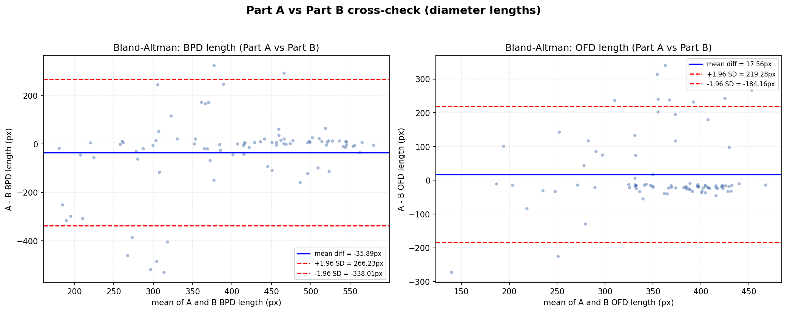

# Fetal-Head Biometry Landmark Localization

<p align="center">
  <a href="LICENSE"></a>
  
  
  
</p>

Automated fetal-head **BPD/OFD** landmark localization on 2-D ultrasound, solved two complementary ways: **(A)** direct heatmap-regression of the four biometry endpoints, and **(B)** cranium segmentation → ellipse geometry to recover the same endpoints. The two routes estimate the same head-ellipse axes, so they cross-check each other independently of any label.

<p align="center">
  
</p>

<p align="center"><em>Parameter count vs. best validation MRE (256-grid) for the three Part A models. The smallest, most structured model is the most accurate.</em></p>

**Contents:** [Results](#results) · [Key findings](#key-findings) · [Approach](#approach) · [Repository layout](#repository-layout) · [Setup & usage](#setup--usage) · [Pretrained weights](#pretrained-weights) · [Data](#data) · [Limitations & future work](#limitations--future-work)

---

## Results

**Part A — landmark localization.** Best validation mean radial error (MRE), measured on the **256×256 grid** the models were trained on:

| Model | Params | Best val MRE (256-grid) |
| --- | --- | --- |
| **SpatialConfiguration-Net (SCN)** | **301 K** | **31.465 px** |
| CoordRegressionNet | 1.70 M | 33.849 px |
| HeatmapUNet | 13.39 M | 117.341 px *(under-converged — see below)* |

> Coordinate-space note: these are **256-grid** numbers. Denormalized to the original ≈ 800×540 pixel space they scale up by ≈ 2.6×, so the original-pixel figures elsewhere in this README are expected to be larger. Every number is labelled with its space.

**Part B — segmentation → geometry.** Best validation Dice on the cranium mask:

| Segmenter | Best val Dice |
| --- | --- |
| SegUNetAttn | 0.9719 |
| SegUNet | 0.9711 |
| Classical CV baseline | none (rule-based by design) |

> The two networks are effectively tied: the attention variant beat plain U-Net by **0.0008 Dice**, within epoch-to-epoch noise. More importantly, **segmentation quality is not landmark accuracy**: the same ≈ 0.97-Dice U-Net is only a ≈ **279 px** exact-point locator (held-out test, **original-pixel** space), because ellipse-axis endpoints are not the physical points the annotator clicked, and within-pair endpoint ordering is arbitrary.

---

## Key findings

- **Structure beats raw capacity (the headline).** The 301 K-param SCN reached the best Part A accuracy (**31.465 px**, 256-grid), beating both a 1.70 M coordinate net (33.849 px) and a 13.39 M heatmap U-Net. Caveat, stated plainly: the U-Net was **under-converged** — an early divergence that its `ReduceLROnPlateau` scheduler could not recover from, plateauing at ≈ 117 px — so this is **not** a fair capacity test. The "structure beats capacity" claim rests on the SCN also beating the **coordinate net**, not on the U-Net result alone.
- **Label noise sets the error floor.** On the held-out test split (**original-pixel** space), Part A's clean-subset MRE (≈ **59 px**) is ≈ **3.2×** lower than its noisy-subset MRE (≈ **190 px**). About 72 % of images are clean; a quantified ≈ 12 %-of-points noisy tail accounts for much of the residual error.
- **A documented naming inversion, not a data fix.** The pair *labelled* "bpd" is the **longer** measurement in ≈ 84 % of rows, where clinically OFD should be longer. This was recorded as a convention difference and the labels were left strictly **read-only — never corrected**.
- **Segmentation quality ≠ landmark accuracy.** Part B reaches ≈ 0.97 Dice yet only ≈ **279 px** exact-point MRE (original-pixel), for the geometric reasons above. A strong segmenter can be a weak exact-landmark locator.
- **The two routes corroborate each other.** A ground-truth-independent Part A vs. Part B cross-check agrees to a **median ≈ 56 px** per-point distance (original-pixel), with small, centered diameter biases (BPD A−B ≈ −36 px, OFD A−B ≈ +18 px) — two independent estimators of the same head-ellipse axes, mutually validating.

**Best method:** Part A's **SpatialConfiguration-Net** — most accurate and smallest — with Part B serving as an independent geometric cross-check rather than a competitor.

---

## Approach

**Part A — deep landmark localization.** Each of the four endpoints is rendered as a per-landmark Gaussian heatmap (σ = 4) and regressed, then decoded by argmax plus a sub-pixel centroid refinement. Three hypotheses were compared at 256×256: a direct coordinate-regression net, a heatmap U-Net (high capacity), and a faithful reproduction of Payer et al.'s SpatialConfiguration-Net. The SCN factorizes the prediction into an **appearance** stream (precise local response) and a low-resolution **spatial-configuration** stream (anatomical layout), whose **element-wise product** suppresses anatomically implausible responses — an explicit prior that lets a 301 K-param model outperform a 13 M-param one here.

<p align="center">
  
</p>

**Part B — segmentation → geometry.** The cranium is segmented to a binary mask, the largest contour is fit with `cv2.fitEllipse`, and the major/minor-axis endpoints are read off as the four biometry points. A purely classical pipeline (Gaussian blur → Otsu → morphology → largest component) serves as a "do we even need deep learning?" control; two U-Nets (plain and attention-gated) are the learned variants. Because both routes ultimately estimate the same head-ellipse axes, comparing them is a meaningful, **label-independent** check: on the held-out test split the two estimators agree to a median ≈ 56 px per-point (original-pixel), with small, centered diameter biases.

<p align="center">
  
</p>

---

## Repository layout

Tracked source only (data, weights, run outputs, and the virtual environment are git-ignored):

```
.
├── README.md
├── LICENSE
├── requirements.txt
├── common/                 # shared dataset, heatmaps, geometry, metrics, splits
├── part_a_landmark/        # landmark models + trainers/testers
│   ├── models.py  train_part_a.py  test_part_a.py
│   └── weights/            # training logs (*_log.csv) tracked; .pth NOT tracked
├── part_b_segmentation/    # segmentation models + geometry decode + trainers/testers
│   ├── classical.py  geometry_decode.py  models.py  train_part_b.py  test_part_b.py
│   └── weights/            # training logs (*_log.csv) tracked; .pth NOT tracked
├── analysis/               # EDA, fusion cross-check, ground-truth audit
│   └── figures/            # report figures (*.png)
├── notebooks/              # Colab training notebooks
├── scripts/                # smoke tests + weight-slimming utility
└── report/                 # report.md, rendered PDF, build_pdf.py
```

Not included in this repository: `data/` (the HC18-derived images, masks, and `ground_truth.csv`), the model checkpoints (`*.pth`), generated `runs/` outputs, and `.venv/`. See [Data](#data) and [Pretrained weights](#pretrained-weights).

---

## Setup & usage

```bash
python -m venv .venv
# Windows:        .venv\Scripts\activate
# macOS / Linux:  source .venv/bin/activate
pip install -r requirements.txt
```

Both testers are **label-free**: point them at any folder of images and they write a `predictions.csv` (four points per image, in **original-pixel** coordinates, in the canonical `image_name, ofd_1_x, … , bpd_2_y` column order) plus a per-image `*_overlay.png`. Metrics (MRE and SR@5/10/20) are printed **only** if you pass `--labels` pointing at a `ground_truth.csv` in that same column layout.

**Part A — landmarks (recommended model: SCN):**

```bash
python part_a_landmark/test_part_a.py \
    --model scn \
    --weights part_a_landmark/weights/slim/part_a_scn.pth \
    --images path/to/images \
    --out-dir runs/scn_infer
# optional scoring:  --labels path/to/ground_truth.csv
```

**Part B — segmentation → geometry:**

```bash
python part_b_segmentation/test_part_b.py \
    --model unet \
    --weights part_b_segmentation/weights/slim/part_b_unet.pth \
    --images path/to/images \
    --out-dir runs/unet_infer
# optional scoring:  --labels path/to/ground_truth.csv
```

Inference is CPU-capable. Flags:

- **Part A** (`test_part_a.py`): `--model {coord,unet,scn}` (required), `--weights` (required), `--images` (required), `--out-dir` (required), `--sigma` (default `4.0`), `--labels` (default none).
- **Part B** (`test_part_b.py`): `--model {unet,unet_attn}` (required), `--weights` (required), `--images` (required), `--out-dir` (required), `--labels` (default none).

---

## Pretrained weights

Slim, weights-only checkpoints (one per trained model) are attached to the [v1.0 release](https://github.com/rohanbalu05/fetal-head-biometry/releases/tag/v1.0). Download them and place them under the matching `weights/slim/` path used in the usage commands above. The **full training checkpoints** (optimizer/scheduler state) are **not** distributed.

---

## Data

The models were trained on a set derived from the public **HC18** fetal-head ultrasound dataset (2-D ultrasound, ~800×540, 8-bit grayscale): [HC18 dataset on Zenodo](https://doi.org/10.5281/zenodo.1322001) (Heuvel et al., *PLOS ONE* 13(8):e0200412, 2018).

The dataset is **not redistributed in this repository.** To reproduce, obtain the data from the source above and place it under `data/` (images, masks, and a `ground_truth.csv` in the canonical column layout) so the paths resolve against `common/config.py`. The frozen patient-grouped split lives in `data/derived/split.json`.

---

## Limitations & future work

These are known and intentional, deferred rather than overlooked:

- **Recover the heatmap U-Net properly.** Re-run it with a warm-up + cosine schedule (or gradient clipping) instead of `ReduceLROnPlateau`, so an early divergence can't permanently collapse the learning rate — enabling a *fair* capacity-vs-structure comparison.
- **Label-noise-aware training.** Use the ground-truth audit directly: robust losses (e.g. Huber/Wing on the points), down-weighting high-distance points, or co-teaching, to keep the ≈ 12 % noisy tail from dominating the gradient.
- **Fuse Part A and Part B** instead of comparing them — e.g. use the SCN landmarks to constrain the ellipse fit, or average the two estimators with outlier rejection.
- **Match the metric to the geometry.** Score Part B with an order-robust, pair-aware metric (Hungarian matching within each pair) and report diameter/HC/CI error alongside per-point MRE.
- **Train at higher resolution + test-time augmentation.** Training at 384–512 (instead of 256, then scaling ≈ 2.6× back) and averaging flips/rotations should tighten original-pixel MRE.

---

**Author:** Rohan Balu  ·  **Reference method:** Payer et al., *Regressing Heatmaps for Multiple Landmark Localization using CNNs*, MICCAI 2016.

The full write-up (methodology, experiments, and all figures) is in [`report/Rohan_Balu_Research_Report.pdf`](report/Rohan_Balu_Research_Report.pdf).
