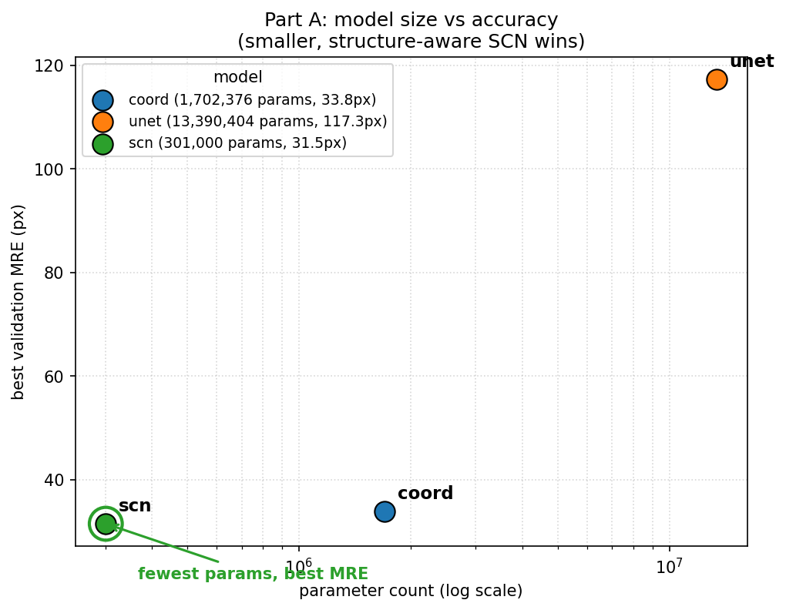

# Fetal-Head Biometry Landmark Localization

### Automated BPD / OFD Endpoint Detection on Ultrasound: Two Complementary Approaches

**Author:** Rohan Balu

**Date:** June 2026

**Reference method:** Payer et al., *Regressing Heatmaps for Multiple Landmark Localization using CNNs*, MICCAI 2016

---

## 1. Motivation

Fetal biometry is one of the most routine, and most consequential, measurements in obstetric ultrasound. Two head measurements anchor it: the **biparietal diameter (BPD)**, the widest side-to-side skull width, and the **occipitofrontal diameter (OFD)**, the front-to-back skull length. Together they give the cephalic index (CI = BPD / OFD) and an estimate of head circumference (HC ≈ 1.62 × (BPD + OFD)), which in turn drive gestational-age estimation, growth tracking, and the early detection of abnormalities such as growth restriction or microcephaly.

Today these measurements are placed by hand. A trained sonographer positions four calipers (outer-to-outer, per ISUOG 2022 guidance) on a correctly acquired axial plane of the head. That reliance on a scarce, highly trained operator is precisely what limits prenatal screening in low-resource settings, where the equipment may exist but the expertise does not. Automating BPD/OFD endpoint localization is therefore a genuinely meaningful target: a reliable automatic locator turns a specialist task into a screening tool and widens access to prenatal care. That is why the problem is worth solving carefully rather than just accurately. The value lies in a method a clinician could trust, audit, and deploy.

---

## 2. Abstract

**Part A: Deep landmark localization.** Part A treats the four biometry endpoints as landmarks and regresses a per-landmark Gaussian heatmap (σ = 4), decoding each point by argmax plus a sub-pixel centroid refinement. Three hypotheses were compared at 256×256 training resolution: a direct coordinate-regression network (1.70 M params, best val MRE **33.849 px**), a heatmap U-Net (13.39 M params, **117.341 px**), and a faithful reproduction of Payer et al.'s SpatialConfiguration-Net (301 K params, **31.465 px**). The smallest, most structured model won: the SCN's explicit anatomical-layout prior beat both higher-capacity baselines, while the U-Net under-converged after an early divergence its plateau scheduler could not recover from. All MREs here are on the 256-grid; denormalized to original pixels they scale ≈ 2.6×. The takeaway is that spatial structure beats raw capacity on limited, noisy data.

**Part B: Segmentation plus geometry.** Part B reaches the same four points indirectly: segment the cranium, fit an ellipse (`cv2.fitEllipse`), and read off its major/minor axis endpoints. Three hypotheses were compared: a purely classical pipeline (Gaussian blur → Otsu → morphology → largest component, no learned weights), a segmentation U-Net (best val Dice **0.9711**), and an attention-gated U-Net (**0.9719**). The two networks segment the head almost identically; the +0.35 M-param attention gates matched but did not meaningfully beat plain U-Net (0.0008 Dice, within epoch-to-epoch noise), because the cranium is a large, high-contrast, near-convex blob with little hard structure left to refine. Crucially, a Dice-0.97 segmenter is still only a modest *exact-landmark* locator (≈ 279 px test MRE, original pixels): ellipse-axis endpoints are not the physical points the annotator clicked.

---

## 3. Introduction

The problem is to locate four fetal-head biometry landmarks on a 2-D ultrasound image: the OFD pair (two points spanning the occipitofrontal axis) and the BPD pair (two points spanning the biparietal axis). Clinically, these four points define two perpendicular calipers across the fetal skull, placed outer-to-outer, from which CI and HC are derived.

This project attacks the problem two complementary ways:

- **Part A (landmarks).** Directly predict the four points, following the heatmap-regression paradigm of Payer et al. (MICCAI 2016). Each landmark becomes a Gaussian "blob" target, and the network learns to reproduce those blobs; the points are then decoded from the predicted heatmaps.
- **Part B (segmentation → geometry).** Predict the *region* of the cranium as a binary mask, then recover the four endpoints with classical geometry: fit an ellipse to the segmented head and take its major- and minor-axis endpoints.

The two routes look unrelated, but they share a single unifying insight: **both are estimating the same head-ellipse axes.** The fetal skull in this plane is, to good approximation, an ellipse; OFD is its long axis and BPD its short axis. Part A learns the axis *endpoints* directly from local appearance and global layout, while Part B learns the *ellipse* and computes its endpoints analytically. That shared geometric target is what makes a Part A vs Part B cross-check meaningful: it is the same measurement reached by two independent estimators, so their agreement (Section 8) is a ground-truth-independent check on both.

---

## 4. Data Pre-Processing / Analysis

**Dataset.** 622 fetal-head ultrasound images with 622 matching cranium masks (HC18-derived), 8-bit grayscale. Most images are 800×540, but there are 14 slightly different sizes in the set. Because of this, **coordinates are always denormalized per image** (never with a single global scale factor), so that a prediction in the 256×256 working space maps back to the correct original-pixel location for each image individually.

**Patient-grouped split.** The 622 images come from only 501 unique patients, since repeat scans exist. Splitting naively by image would leak the same patient's anatomy across train/val/test and inflate the metrics. To prevent that, a **patient-grouped split** was used: 351 / 75 / 75 patients give **440 train / 92 val / 90 test** images, with **zero patient overlap**. The exact split is frozen in `data/derived/split.json` and reused by every experiment, so all numbers in this report are comparable.

**Pre-processing.** Images are resized to 256×256 grayscale for training and validation. For Part A, each landmark is rendered as a Gaussian heatmap (σ = 4). For Part B, the thin binary outline masks are flood-filled into solid cranium regions to serve as segmentation targets. Light data augmentation is applied (Section 6).

**Ground-truth audit.** Before trusting any metric, the labels themselves were audited (`data/derived/gt_consistency.csv`), measuring each annotated point against the segmented head. Two findings stand out, and both were **documented, never corrected**, since the labels are treated as strictly read-only:

1. **The data is mostly clean, with a real noisy tail.** About **72.3 %** of images are "clean," meaning all four points lie within 30 px of the segmented head. But a genuine noisy-label tail exists: **≈ 11.9 %** of all points sit > 50 px off the head, and **≈ 5.9 %** sit > 150 px off. This is not "wildly wrong" data; it is good data with a quantified minority of bad labels, and that minority sets a floor on achievable error (Section 8).
2. **A systematic naming inversion.** In **≈ 83.9 %** of rows, the pair *labeled* "bpd" is actually the **longer** measurement, yet clinically the OFD (front-to-back) should be the longer axis. The most reasonable reading is that the dataset's naming convention is simply flipped relative to the clinical one. This was recorded as a known, consistent convention difference and **left untouched in the labels**; it matters for interpretation, not for correction.

**Label policy.** All 622 images were kept for training. Part A accuracy is reported on **both** the full set and the clean subset, so the reader can separate model error from label noise.

---

## 5. Model Architecture

### Part A: deep landmark localization

| Hyp. | Model | Idea | Params |
| --- | --- | --- | --- |
| H1 | **CoordRegressionNet** | Convolutional encoder → fully-connected head that regresses the 8-vector (4 points × x,y) directly. | 1,702,376 |
| H2 | **HeatmapUNet** | Encoder-decoder U-Net that outputs one heatmap channel per landmark; points decoded from the heatmaps. | 13,390,404 |
| H3 | **SpatialConfigurationNet (SCN)** | Faithful reproduction of Payer et al. (2016). | 301,000 |

- **H1 (CoordRegressionNet)** is the simplest baseline: it skips heatmaps and maps the image straight to coordinates. It is cheap and direct, but it throws away spatial structure (the output is just eight numbers), so it has no built-in notion of where landmarks sit relative to one another.
- **H2 (HeatmapUNet)** is the high-capacity heatmap regressor. A U-Net's skip connections preserve spatial detail, and in Payer's work the U-Net-style net was the *strong* network. It was included to test whether raw capacity plus dense heatmap supervision would dominate.
- **H3 (SCN)** is the architecture the whole project is built around. It factorizes the prediction into two streams whose **element-wise product** is the final heatmap, following Payer's Eq. 3: `H_i = H_app_i ⊙ H_acc_i`. An **appearance** block produces a *local* landmark response, which is good at precise location but easily fooled by repeated local texture in speckled ultrasound. A **spatial-configuration** block is computed at *low resolution with large kernels*, so it encodes the *anatomical layout* (roughly, "given the other landmarks, where should this one be?") before being upsampled. Multiplying the two suppresses appearance responses that are anatomically implausible. That explicit prior is exactly why a 301 K-param model can outperform a 13 M-param one here.

### Part B: segmentation → geometry

| Hyp. | Model | Idea | Weights |
| --- | --- | --- | --- |
| H1 | **Classical CV baseline** | Gaussian blur → Otsu threshold → morphological close/open → largest connected component. | none (rule-based by design) |
| H2 | **SegUNet** | Standard segmentation U-Net (Dice + BCE). | trained |
| H3 | **SegUNetAttn** | SegUNet + attention gates on the skip connections (+≈ 0.35 M params). | trained |

All three feed the same decoder, `mask_to_biometry`: take the largest contour, run `cv2.fitEllipse`, and emit the major/minor-axis endpoints as the four biometry points.

- **H1 (classical)** has no trained weights *by design*. It exists to motivate the learned approach: on speckled ultrasound, Otsu plus morphology readily latches onto internal brain tissue rather than the skull, so the fitted ellipse misses the head. It is the "do we even need deep learning?" control, and it shows we do.
- **H2 (SegUNet)** is the learned workhorse: a clean encoder-decoder that segments the cranium as a region.
- **H3 (SegUNetAttn)** adds attention gates to the skip connections, which suppress irrelevant skip features and, in principle, sharpen boundaries. It was included to test whether attention buys a meaningful gain on this particular, fairly easy, segmentation target.

---

## 6. Experimental Setting

| Setting | Part A (landmarks) | Part B (segmentation) |
| --- | --- | --- |
| Input | 256×256 grayscale | 256×256 grayscale |
| Target | per-landmark Gaussian heatmaps, σ = 4 | flood-filled binary cranium mask |
| Loss | MSE on heatmaps | Dice + BCE |
| Optimizer | Adam, lr = 1e-3 | Adam, lr = 1e-3 |
| Scheduler | ReduceLROnPlateau | ReduceLROnPlateau |
| Augmentation | yes (geometric/intensity) | yes (geometric/intensity) |
| Batch size | 16 | 16 |
| Epochs | SCN 80 · U-Net 70 · coord 50 | 40 per segmenter |
| Decode | argmax + sub-pixel centroid | largest contour → `cv2.fitEllipse` → axis endpoints |

**Hardware / stack.** Training on a Colab **T4 GPU**; inference is **CPU-capable**. Implemented in **PyTorch**, code follows **PEP-8**. The frozen patient-grouped split (Section 4) is shared across all runs, and each trainer auto-resumes, logs per-epoch metrics to CSV, and checkpoints on the best validation metric, so every reported number is traceable to a logged run.

One deliberate note on the **ReduceLROnPlateau** choice: it is the right default for stable training, but it interacts badly with an early divergence (see H2 in Section 8). That interaction is reported rather than hidden, because it is itself an experimental finding.

---

## 7. Hypothesis tried

Three hypotheses were tried **per part** (six total), each chosen to probe a specific question rather than to pad the count.

**Part A: "How should we inject structure into a landmark regressor?"**

1. **H1 CoordRegressionNet: no injected structure (direct regression).** Tests the floor: can a plain CNN just regress coordinates? Justified as the cheapest possible baseline and a sanity check on the heatmap machinery.
2. **H2 HeatmapUNet: structure via capacity plus dense supervision.** Tests whether a large, skip-connected heatmap regressor (Payer's strong-net family) wins by sheer capacity and spatial fidelity.
3. **H3 SCN: structure via an explicit anatomical prior.** Tests whether a small network with a hard-wired appearance × spatial-configuration factorization beats raw capacity. This is the central hypothesis.

**Part B: "How should we turn a region into the four points, and does refinement pay off?"**

1. **H1 Classical CV: no learning.** Tests whether classical thresholding suffices, and motivates learning when it does not.
2. **H2 SegUNet: learned segmentation.** Tests whether a standard U-Net segments the cranium well enough that ellipse geometry recovers usable axes.
3. **H3 SegUNetAttn: learned segmentation plus attention refinement.** Tests whether attention gates meaningfully improve an already-easy segmentation target: that is, *when does a refinement actually pay off?*

---

## 8. Results

### 8.1 Part A: training behaviour and the structure-vs-capacity result

The three Part A models tell a clean story. On the **256×256 grid** (the resolution at which they were trained and validated):

| Part A hypothesis | Params | Best val MRE (256-grid) | Verdict |
| --- | --- | --- | --- |
| H3 SpatialConfigurationNet | **301 K** | **31.465 px** | best accuracy **and** fewest params |
| H1 CoordRegressionNet | 1.70 M | 33.849 px | competitive but beaten |
| H2 HeatmapUNet | 13.39 M | 117.341 px | **under-converged** (see below) |

> **Coordinate-space note (read this before comparing to Section 8.2).** Every MRE in this table is on the **256-grid**. When points are denormalized to the original ≈ 800×540 pixel space they scale up by ≈ 2.6×, so the original-pixel numbers in the cross-check below are *expected* to be larger. Each number in this report is explicitly labelled with its space.

The training curves make the headline visible: the SCN and coordinate net settle to a low, stable val MRE, while the heatmap U-Net **diverges in its early epochs and never recovers**. The mechanism, reported honestly, is that the ReduceLROnPlateau scheduler reacted to the early instability by driving the learning rate too low to climb back out, and the model plateaued around 117 to 120 px. This is **not** a clean reproduction of Payer's U-Net (which was their strong network); it is an under-converged run, and it is reported as such.

The parameter-vs-error view is the single most important plot in this work: the **smallest** model is the **most accurate**. The SCN reaches 31.465 px with 301 K params (fewer than a fifth of the coordinate net's, and roughly 1/44 of the U-Net's), yet beats both. This is the core finding: **in a limited, noisy-data regime, an explicit spatial/anatomical prior beats raw capacity.** Capacity without structure (H2) was not just unhelpful here; it was actively harder to optimize.

### 8.2 Part B: segmentation quality, and the exact-point gap

The two Part B segmenters are essentially tied:

| Part B hypothesis | Best val Dice |
| --- | --- |
| H3 SegUNetAttn | 0.9719 |
| H2 SegUNet | 0.9711 |

The +0.35 M-param attention variant beat plain U-Net by **0.0008 Dice**, well inside epoch-to-epoch noise. The honest reading is not "attention failed" but "attention had nothing to fix": the cranium is a large, high-contrast, near-convex blob that a plain U-Net already segments at ≈ 0.97 Dice, leaving little hard structure for attention gates to refine. The lesson here is about **knowing when a refinement pays off**; in this case it didn't, and pretending otherwise would be dishonest.

### 8.3 Fusion cross-check (held-out 90-image TEST split, original-pixel space)

The fusion analysis (`analysis/fusion.py`) compares Part A and Part B against the ground truth and against *each other*, on the held-out test split, in **original-pixel** space.

**Part A (SCN) vs GT.** Full set **105.6 px**, clean subset **59.1 px**, noisy subset **189.7 px**. The ≈ 3.2× clean-vs-noisy gap is the key honesty point: **much of the full-set error is label noise, not model error.** For reference, the same SCN measured on the 256-grid is ≈ 40.5 px full / ≈ 21.7 px clean, consistent with the 31.465 val MRE and with the ≈ 2.6× scale-up to original pixels.

**Part B (U-Net) vs GT.** ≈ **279 px** full, much worse than Part A at *exact-point* recovery despite ≈ 0.97 Dice. There are two honest reasons: (a) ellipse-axis endpoints are simply **not the same physical points** the annotator clicked; and (b) within a pair, endpoint ordering (`_1` vs `_2`) is **geometric/arbitrary**, so index-to-index scoring penalizes harmless flips. A Dice-0.97 segmenter can therefore still score poorly as an exact-landmark locator: **segmentation quality is orthogonal to landmark-label matching.**

**A-vs-B agreement (GT-independent, order-robust geometry).** Independent of any label, the two routes agree to a **median per-point distance of ≈ 56 px** (mean ≈ 103 px, pulled up by a few outliers; median is the honest headline). Diameter biases are small and centered (BPD A−B ≈ −36 px, OFD A−B ≈ +18 px). Clinical scalars: |CI| median ≈ 14, |HC| median ≈ 57 px (means are outlier-inflated). That two independently-built estimators of the same head-ellipse axes land within ~56 px of each other is real, mutually-corroborating evidence that both are tracking the true anatomy.

---

## 9. Key Findings

- **Structure beats raw capacity (the headline).** The 301 K-param SpatialConfiguration-Net achieved the best Part A accuracy (31.465 px val, 256-grid), beating a 1.70 M coordinate net and a 13.39 M heatmap U-Net. Reproducing Payer et al., an explicit anatomical-layout prior outperformed brute capacity on limited, noisy data.
- **Label noise sets the error floor.** On the held-out test split, Part A's clean-subset MRE (≈ 59 px, original pixels) is ≈ 3.2× lower than its noisy-subset MRE (≈ 190 px). Roughly 72 % of images are clean; a quantified ≈ 12 %-of-points noisy tail accounts for much of the residual error, so model quality and label quality were separated rather than conflated.
- **A documented naming inversion, not a data fix.** The pair labelled "bpd" is the longer measurement in ≈ 84 % of rows (clinically OFD should be longer). This was recorded as a convention difference and **never altered** in the labels.
- **Segmentation quality ≠ landmark accuracy.** Part B reaches ≈ 0.97 Dice yet only ≈ 279 px exact-point MRE, because ellipse endpoints aren't the clicked points and endpoint ordering is arbitrary. A strong segmenter can be a weak exact-landmark locator.
- **Refinement only pays off where there's something to refine.** Attention gates matched but did not beat plain U-Net (0.0008 Dice) on an already-easy, near-convex target.
- **The two routes corroborate each other.** A GT-independent Part A vs Part B cross-check agrees to ≈ 56 px median per-point, with small, centered diameter biases: two independent estimators of the same head-ellipse axes, mutually validating.

**Best method:** Part A's **SpatialConfiguration-Net**. It is the most accurate and the smallest, and the most defensible to deploy, with Part B serving as an independent geometric cross-check rather than a competitor.

---

## 10. Future Work

Given more time, the most promising directions are:

1. **Recover the heatmap U-Net properly.** Re-run H2 with a warm-up plus cosine schedule (or gradient clipping) instead of ReduceLROnPlateau, so an early divergence can't permanently collapse the learning rate. This would give a fair capacity-vs-structure comparison and would likely lift the U-Net well below 117 px.
2. **Label-noise-aware training.** Use the audit (Section 4) directly. Robust losses (e.g. Huber/Wing loss on the points), loss down-weighting of high-distance points, or co-teaching would keep the ≈ 12 % noisy tail from dominating the gradient, and the clean/noisy gap suggests a real ceiling to be reclaimed.
3. **Fuse Part A and Part B instead of comparing them.** Use the SCN landmarks to constrain the ellipse fit, or average the two estimators with outlier rejection. The ≈ 56 px median agreement and small, centered biases suggest a fused estimate would be more robust than either alone.
4. **Match the metric to the geometry.** Score Part B with an order-robust, pair-aware metric (Hungarian matching within each pair) and report a diameter/HC/CI error alongside per-point MRE, so segmentation strength isn't masked by arbitrary endpoint ordering.
5. **Train at higher resolution and add test-time augmentation.** Working at 256×256 and then scaling ≈ 2.6× back to original pixels amplifies error; training at 384 to 512 and averaging flips/rotations at inference should tighten original-pixel MRE.
6. **Resolve the naming inversion at the application layer.** Keep the labels read-only, but expose a clearly-documented convention mapping in the inference output so downstream clinical use isn't tripped up by the BPD/OFD flip.
